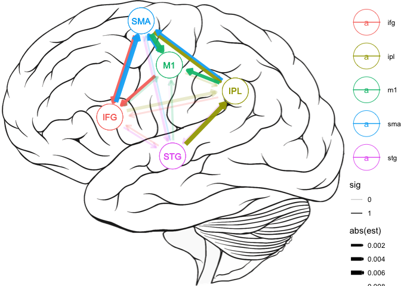
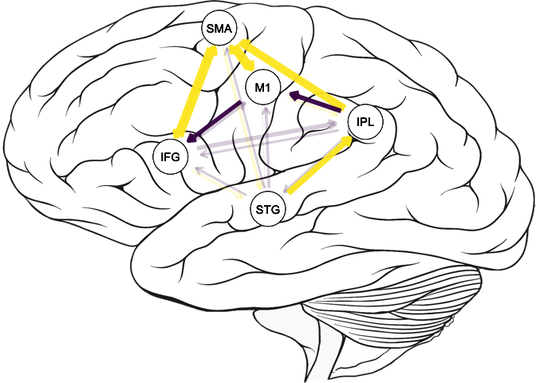

<!-- README.md is generated from README.Rmd. Please edit that file -->

# connectivity

The goal of connectivity is to make the importing, cleaning, and
analyzing of NIRS data recipe based. That is, we will use a simple
recipe to take our individual NIRS files and make clear, concise
analyses with interpretable output. Our approach uses a type of
Granger-Causality approach using linear mixed effects models.

## Installation

You can install the GitHub version of `connectivity` with:

``` r
remotes::install_github("tysonstanley/connectivity")
```

## Example

The receipe is as follows:

1.  Import and Clean
2.  Analyze
3.  Visualize

The `import_nirs()` function depends on a files structure that looks
something like:

    -- P07
       |__ons.txt
       |__P07_brodExtract.csv
       |__P07_HBA_Probe1_Oxy.csv
       |__P07_HBA_Probe2_Oxy.csv
    -- P08
       |__ons.txt
       |__P08_brodExtract.csv
       |__P08_HBA_Probe1_Oxy.csv
       |__P08_HBA_Probe2_Oxy.csv
    -- P09
       |__ons.txt
       |__P09_brodExtract.csv
       |__P09_HBA_Probe1_Oxy.csv
       |__...

where each participant has its own folder with the data within that
folder. Other files can be within the individual folders, but the ones
shown are required.

In our data (not currently provided), we have 5 regions that we are
interested in that are mapped out in the `*brod.csv` files. To inform on
what region goes with which channel from the Probe files, we use the
import function like so:

``` r
## Superior Temporal Gyrus (STG),
## Inferior Parietal Lobule (made up of Supramarginal Gyrus and Angular Gyrus),
## Inferior frontal Gyrus (IFG),
## Supplementary Motor Association (SMA) and
## the Motor Cortex (M1)

library(connectivity)

path <- "~/Box/Stuttering Writing Group/PhoneCallsControl/"
data <- import_nirs(path,
                    stg = 22, ipl = c(39, 40), ifg = c(44, 45), sma = 6, m1 = 4)
```

The `stg = 22, ipl = c(30, 40), ...` correspond to regions (the name)
and their number in the `*brod.csv` file. This creates a nested tibble
called `data` that looks like this:

``` r
data
#> # A tibble: 8 x 2
#>   participant probe_data            
#>   <chr>       <list>                
#> 1 P01         <tibble [22,231 × 67]>
#> 2 P02         <tibble [21,328 × 67]>
#> 3 P03         <tibble [23,195 × 67]>
#> 4 P04         <tibble [22,927 × 67]>
#> 5 P05         <tibble [20,048 × 67]>
#> 6 P06         <tibble [30,105 × 67]>
#> 7 P07         <tibble [25,296 × 67]>
#> 8 P16         <tibble [23,481 × 67]>
```

The `probe_data` variable contains all the NIRS information about the
corresponding participant. From here, we can run our connectivity
analysis, which will run a series of linear mixed effects models. If we
specify a group variable, the models will include a region by group
interaction. Here, we are only going to use the “resting” task for these
analyses.

``` r
## Subset the data to just resting and assign to `rest`
rest <- data 
rest$probe_data = purrr::map(rest$probe_data, ~.x %>% filter(task == "rest"))
## Make sure `rest` still contains information on the regions in the data
attr(rest, "regions")
#> [1] "stg" "ipl" "ifg" "sma" "m1"
```

``` r
fits <- get_connectivity(rest, covariates = c("(1 | participant)"))
fits
#>    outcome rowname           est        pvalue
#> 1      stg     ipl  4.376005e-03  8.145314e-30
#> 2      stg     ifg -4.961040e-04  7.996392e-02
#> 3      stg     sma  1.052798e-03  1.246254e-03
#> 4      stg      m1  8.951639e-04  3.250976e-03
#> 5      stg     lag  7.442713e-01  0.000000e+00
#> 6      ipl     stg  7.350928e-03 7.048862e-100
#> 7      ipl     ifg -4.874742e-04  4.933006e-02
#> 8      ipl     sma  1.880710e-03  4.277159e-11
#> 9      ipl      m1  2.598230e-03  1.554066e-22
#> 10     ipl     lag  5.598306e-01  0.000000e+00
#> 11     ifg     stg -1.018016e-03  5.702581e-05
#> 12     ifg     ipl -2.722969e-04  2.683142e-01
#> 13     ifg     sma  2.648069e-03  9.066254e-37
#> 14     ifg      m1 -3.739533e-04  5.502803e-02
#> 15     ifg     lag  4.847889e-01  0.000000e+00
#> 16     sma     stg  7.927645e-04  9.182510e-04
#> 17     sma     ipl  1.522572e-03  6.228829e-11
#> 18     sma     ifg  3.941814e-03 2.702654e-117
#> 19     sma      m1  3.202557e-03  3.724921e-68
#> 20     sma     lag  3.501678e-01  0.000000e+00
#> 21      m1     stg -2.438002e-04  3.987967e-01
#> 22      m1     ipl -3.672036e-05  8.960351e-01
#> 23      m1     ifg -7.147157e-04  5.585376e-04
#> 24      m1     sma  2.670882e-03  5.832803e-29
#> 25      m1     lag  3.374576e-01  0.000000e+00
```

This `fits` object has all the estimates from the various models and
their corresopnding p-values (based on Satterthwaite approximation to
degrees of freedom). The `est` variable shows us the effect size for
each variable. This effect size is the average individuals standardized
coefficient (similar to a partial correlation). (Note that `lag` is the
1 lag of the outcome variable and so its effect sizes will almost always
be really big).

We can visualize these results in two main ways:

1.  Simple graphs highlighting the effect size
2.  Brain visualization where the various regions are mapped onto a
    diagram of a brain

Here, we quickly show both.

#### Effect Size Graphs

``` r
effectsize_viz(fits)
```


#### Brain Visualization

``` r
brain_viz(fits)
```



For this brain viz, there is a built-in list of regions with
corresponding `x` and `y` values that fit this diagram.

``` r
connectivity::regions
#> # A tibble: 8 x 3
#>       x     y region
#>   <dbl> <dbl> <chr> 
#> 1   5     4.5 stg   
#> 2   7     7   ipl   
#> 3   3     6   ifg   
#> 4   4     9.7 sma   
#> 5   4.9   8   m1    
#> 6   1     8.6 mpc   
#> 7   0     6.8 dpcl  
#> 8   0     9.3 dpcr
```

However, if you want to add your own, you can. You need to make sure the
names you give the regions in the `import_nirs()` function matches the
names in the regions and that this `regions` data frame has the names
`x`, `y`, and `region`. For example, let’s say we are only interested in
three of these regions now. We could use the following `regs` data frame
to adjust not only what is shown but where they are shown. Importantly,
the values for the `x` and `y` are bound between 0 and 10 (0 being the
left/bottom and 10 being right/top) and so this example is extreme.

``` r
regs <- tibble::tribble(
  ~x, ~y, ~region,
   1,  1,  "stg",
   5,  9,  "ipl",
   9,  1,  "ifg" 
)

brain_viz(fits, regs = regs)
```


