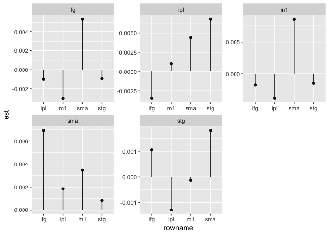
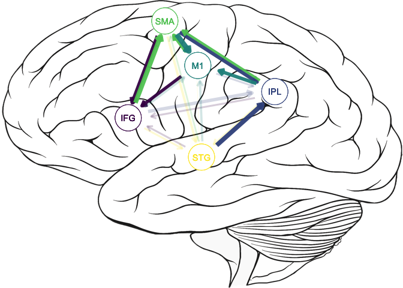
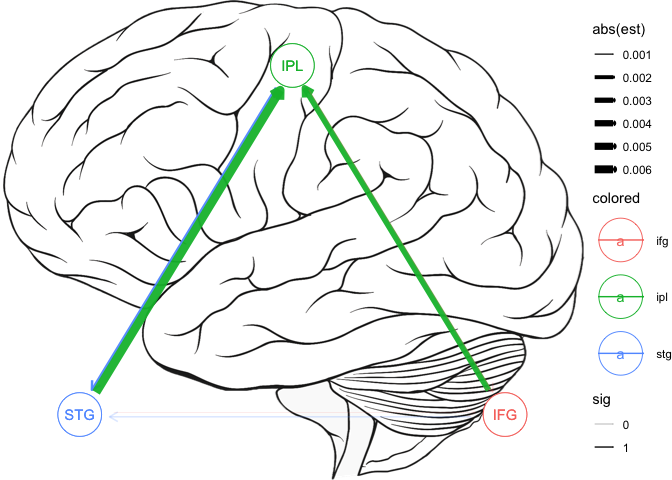
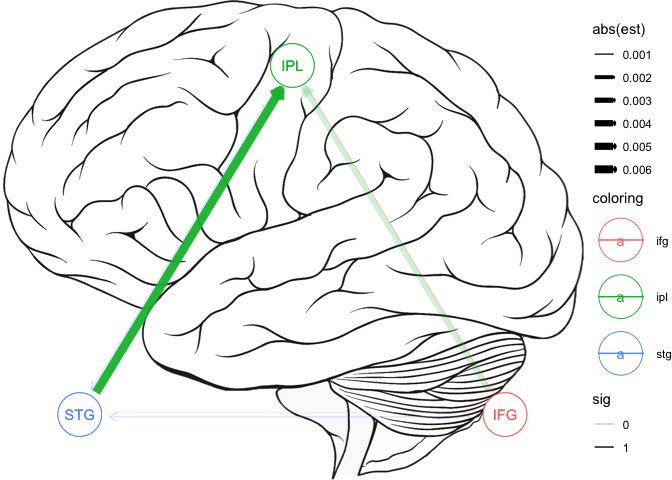

<!-- README.md is generated from README.Rmd. Please edit that file -->

# `connectivity` `v0.1.4` 

The goal of connectivity is to make the importing/cleaning, analyzing,
and visualizing of NIRS data recipe based. That is, we will use a simple
recipe to take our individual NIRS files and make clear, concise
analyses with interpretable output. Our approach uses a
Granger-Causality-type approach using linear mixed effects models.

## Installation

You can install the GitHub version of `connectivity` with:

``` r
remotes::install_github("tysonstanley/connectivity")
```

## Example

The receipe is as follows:

1.  Import and Clean (`import_nirs()`)
2.  Analyze (`get_connectivity()`)
3.  Visualize (`effectsize_viz()` or `brain_viz()`)

### Step 1. Import and Clean

The `import_nirs()` function depends on a files structure that looks
something like:

    -- P07
       |__onset.txt
       |__P07_brodExtract.csv
       |__P07_HBA_Probe1_Oxy.csv
       |__P07_HBA_Probe2_Oxy.csv
    -- P08
       |__onset.txt
       |__P08_brodExtract.csv
       |__P08_HBA_Probe1_Oxy.csv
       |__P08_HBA_Probe2_Oxy.csv
    -- P09
       |__onset.txt
       |__P09_brodExtract.csv
       |__P09_HBA_Probe1_Oxy.csv
       |__...

where each participant has its own folder with the data within that
folder. Other files can be within the individual folders, but the ones
shown are required.

In our data (not currently provided), we have 5 regions that we are
interested in that are mapped out in the `*brod.csv` files. To inform on
what region goes with which channel from the Probe files, we use the
import function like so:

``` r
library(connectivity)

path <- "~/Box/Stuttering Writing Group/PhoneCallsControl/"
data <- import_nirs(path,
                    stg = 22, ipl = c(39, 40), ifg = c(44, 45), sma = 6, m1 = 4)
```

where we are interested in the following regions:

  - Superior Temporal Gyrus (STG),
  - Inferior Parietal Lobule (made up of Supramarginal Gyrus and Angular
    Gyrus),
  - Inferior frontal Gyrus (IFG),
  - Supplementary Motor Association (SMA) and
  - the Motor Cortex (M1).

The `stg = 22, ipl = c(30, 40), ...` correspond to regions (the name of
the region) and the number refers to the number in the `*brod.csv` file.
This creates a nested tibble called `data` that looks like this:

``` r
data
#> # A tibble: 7 x 2
#>   participant probe_data            
#>   <chr>       <list>                
#> 1 P01         <tibble [22,239 × 67]>
#> 2 P03         <tibble [23,204 × 67]>
#> 3 P04         <tibble [22,936 × 67]>
#> 4 P05         <tibble [20,056 × 67]>
#> 5 P06         <tibble [30,114 × 67]>
#> 6 P07         <tibble [25,305 × 67]>
#> 7 P16         <tibble [23,486 × 67]>
```

The `probe_data` variable contains all the NIRS information about the
corresponding participant. We need to make sure that the data still have
the “regions” attribute with the names of the regions that you are
interested in. This information is used in the next step.

``` r
## Subset the data to just resting and assign to `rest`
rest <- data 
rest$probe_data = purrr::map(rest$probe_data, ~.x %>% filter(task == "rest"))
## Make sure `rest` still contains information on the regions in the data
attr(rest, "regions")
#> [1] "stg" "ipl" "ifg" "sma" "m1"
```

### Step 2. Analyze

From here, we can do our connectivity analyses, which will run a series
of linear mixed effects models. If we specify a group variable, the
models will include a region by group interaction. Here, we are only
going to use the “resting” task for these analyses (that we created
above). The `get_connectivity()` function runs the linear mixed models
and provides us with a tibble where it shows us our outcome (`outcome`),
the predictor region (`rowname`), the effect size estimate (`est`), and
the p-value (`pvalue`).

``` r
fits <- get_connectivity(rest, covariates = c("(1 | participant)"))
fits
#>    outcome rowname           est       pvalue
#> 1      stg     ipl -0.0012854233 4.098717e-02
#> 2      stg     ifg  0.0010528857 2.175877e-01
#> 3      stg     sma  0.0018098305 2.400770e-02
#> 4      stg      m1 -0.0001314380 8.288871e-01
#> 5      stg     lag  0.5951213771 0.000000e+00
#> 6      ipl     stg  0.0068348462 5.309958e-12
#> 7      ipl     ifg -0.0035143519 1.620990e-02
#> 8      ipl     sma  0.0044339404 9.635422e-04
#> 9      ipl      m1  0.0010296516 3.050960e-01
#> 10     ipl     lag  0.5523334334 0.000000e+00
#> 11     ifg     stg -0.0009576724 6.260133e-02
#> 12     ifg     ipl -0.0010242724 5.790339e-02
#> 13     ifg     sma  0.0053455916 7.133882e-14
#> 14     ifg      m1 -0.0030414322 3.975775e-09
#> 15     ifg     lag  0.5315290144 0.000000e+00
#> 16     sma     stg  0.0008315454 4.110240e-02
#> 17     sma     ipl  0.0018432310 1.563944e-05
#> 18     sma     ifg  0.0069252798 6.357022e-27
#> 19     sma      m1  0.0034547031 1.960396e-17
#> 20     sma     lag  0.2008891863 0.000000e+00
#> 21      m1     stg -0.0014515723 9.122225e-03
#> 22      m1     ipl -0.0038264659 6.296958e-11
#> 23      m1     ifg -0.0017079992 4.328194e-02
#> 24      m1     sma  0.0085802104 1.031991e-27
#> 25      m1     lag  0.2522870952 0.000000e+00
```

In this case, this `fits` object has all the estimates from the various
models and their corresopnding p-values (based on Satterthwaite
approximation to degrees of freedom). The `est` variable shows us the
effect size for each variable. This effect size is the average
individuals standardized coefficient (similar to a partial correlation).
(Note that `lag` is the 1 lag of the outcome variable and so its effect
sizes will almost always be really big and is generally not of direct
interest).

### Step 3. Visualize

We can visualize these results in two main ways:

1.  Simple graphs highlighting the effect size
2.  Brain visualization where the various regions are mapped onto a
    diagram of a brain

Here, we quickly show both.

Notably, both approaches use `ggplot2` and can be adjusted with
`ggplot2` functions.

#### Effect Size Graphs

This shows the size of the effects as simple line graphs as shown below.

``` r
effectsize_viz(fits)
```



#### Brain Visualization

The brain visuals are the most flexible visualization. At its simplest,
it shows the regions of interest on the side view of the brain.

``` r
brain_viz(fits)
```


To control the colors of the circles and lines, use any of the ggplot2
scale\_color\_\* functions:

``` r
brain_viz(fits) +
  scale_color_viridis_d()
```



For this brain viz, there is a built-in list of regions with
corresponding `x` and `y` values that fit this diagram.

``` r
connectivity::regions_side
#> # A tibble: 8 x 3
#>       x     y region
#>   <dbl> <dbl> <chr> 
#> 1   5     4.5 stg   
#> 2   7     7   ipl   
#> 3   3     6   ifg   
#> 4   4     9.7 sma   
#> 5   4.9   8   m1    
#> 6   1     8.6 mpc   
#> 7   0     6.8 dpcl  
#> 8   0     9.3 dpcr
```

However, if you want to add your own, you can. You need to make sure the
names you give the regions in the `import_nirs()` function matches the
names in the regions and that this `regions` data frame has the names
`x`, `y`, and `region`. For example, let’s say we are only interested in
three of these regions now. We could use the following `regs` data frame
to adjust not only what is shown but where they are shown. Importantly,
the values for the `x` and `y` are bound between 0 and 10 (0 being the
left/bottom and 10 being right/top) and so this example is extreme.

``` r
regs <- tibble::tribble(
  ~x, ~y, ~region,
   1,  1,  "stg",
   5,  9,  "ipl",
   9,  1,  "ifg" 
)

brain_viz(fits, regs = regs)
```



In addition to this side diagram (`view = "side"`), the other built-in
images include a top view (`view = "top"`), an angled left side (`view =
"left"`), and an angled right side (`view = "right"`). \[1\]




## Conclusion

This package is designed to import/clean, analyze, and visualize a
specific set of data. If your data do not follow the general outline
shown above, then this package will likely throw errors. It is still in
heavy development. Contact <t.barrett@aggiemail.usu.edu> for questions
or comments.

1.  Note that the `view = "top"` has functionality that allows each
    probe to be different sides of the brain.
